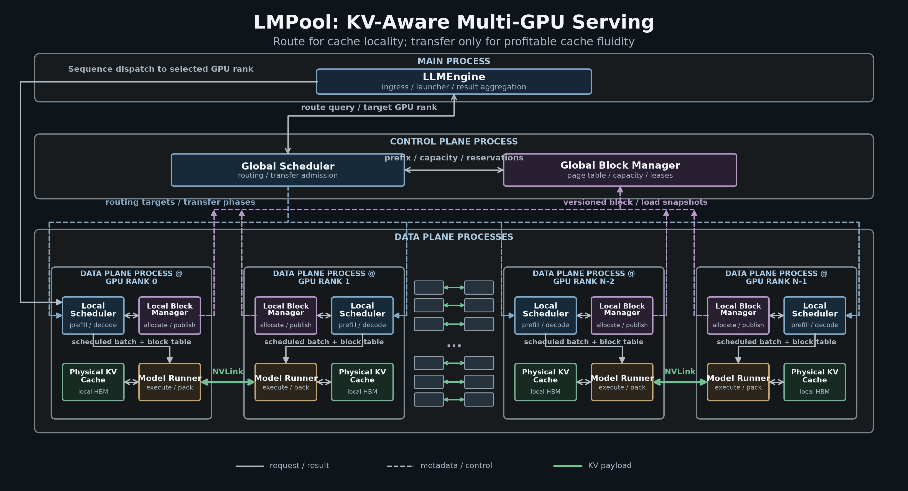
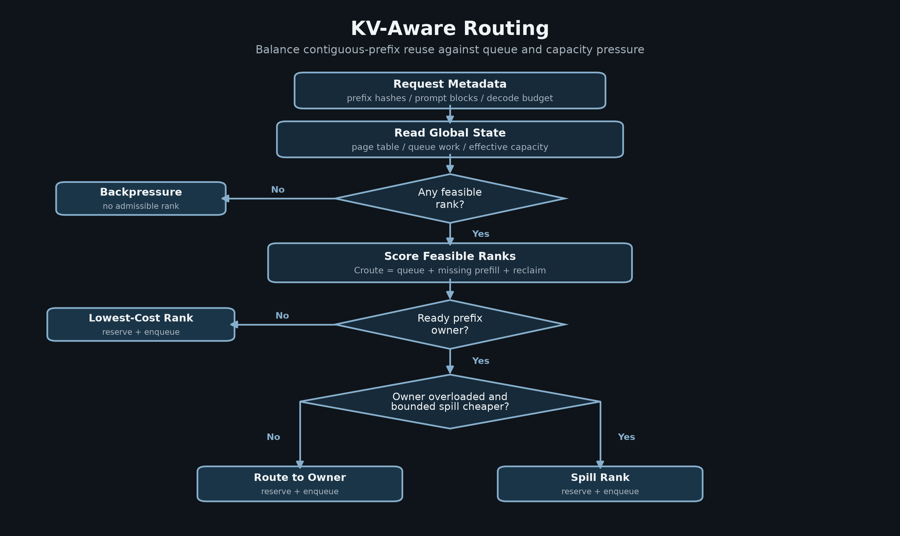
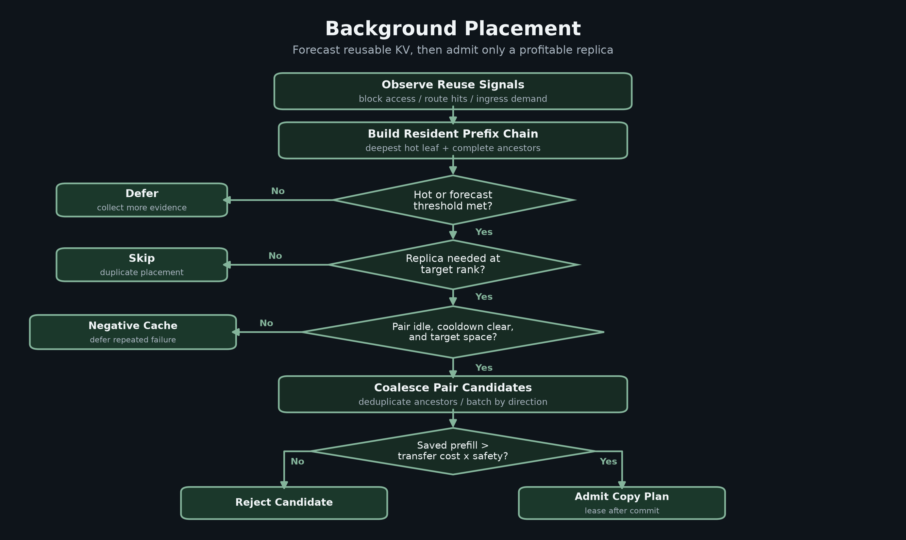
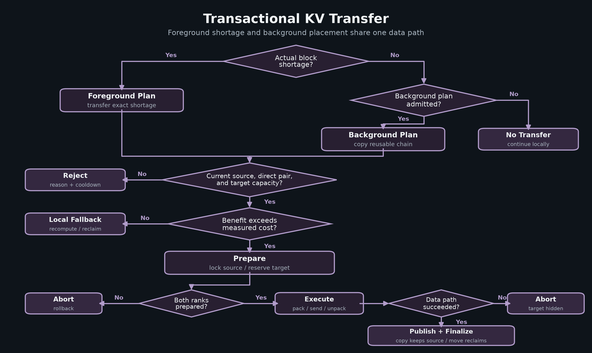
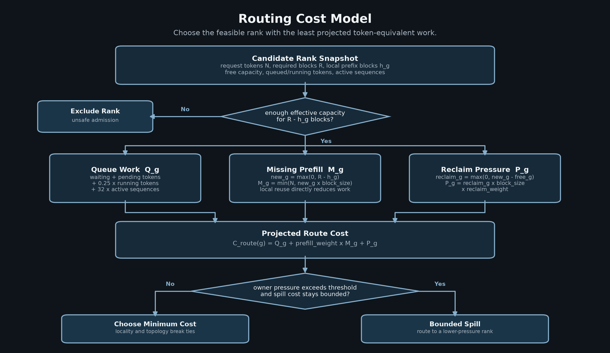
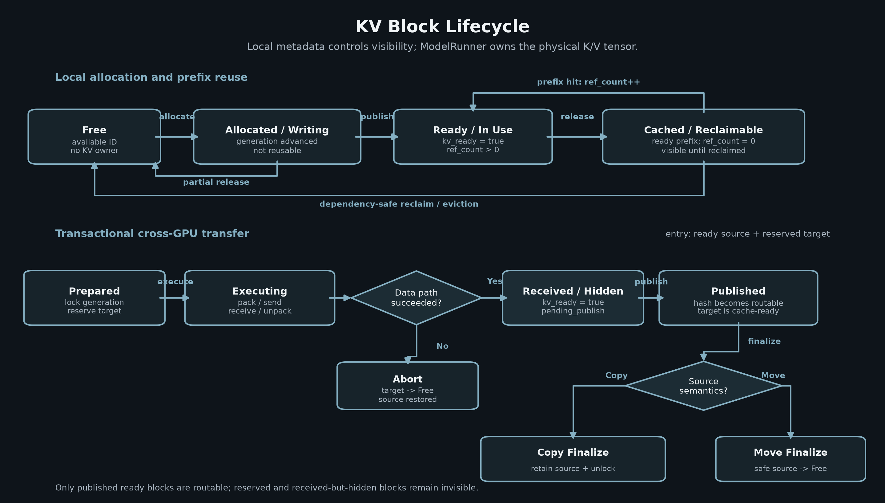
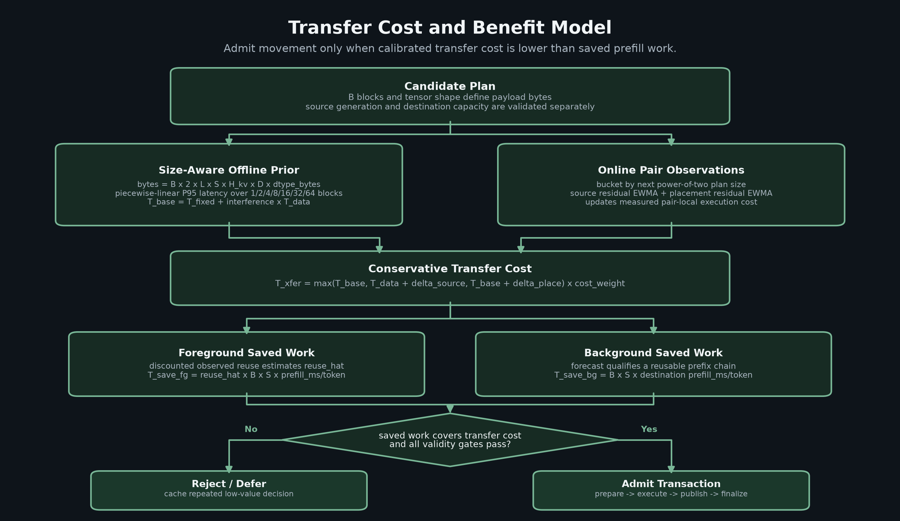
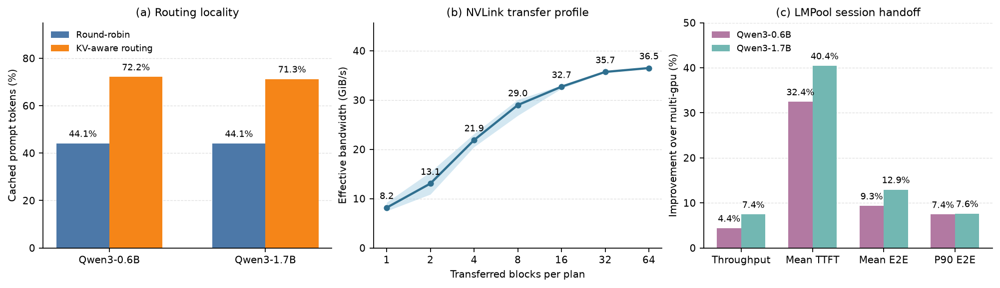

<p align="center">
  
</p>

<p align="center">
  <a href="./README.md"><b>English</b></a> |
  <a href="./README_zh.md"><b>简体中文</b></a>
</p>

# LMPool: KV-Aware Routing and NVLink Transfer for Multi-GPU LLM Serving

LMPool is a research prototype built on [Mini-vLLM](https://github.com/Wenyueh/MinivLLM). It coordinates the physically local PagedAttention KV caches of multiple data-parallel LLM replicas through a dedicated control plane.

The design follows two principles:

1. **Routing for cache locality.** Send a request to a GPU that already holds its useful KV prefix when the saved prefill work outweighs queue and capacity pressure.
2. **Transfer for cache fluidity.** When KV placement and request load diverge, copy or move valuable blocks over direct NVLink if the expected reuse amortizes data movement.

In short: route to avoid transfer; use fast transfer only when movement is unavoidable and profitable. LMPool is a logically coordinated KV pool, not transparent shared HBM. Each worker remains the physical owner of its blocks and KV tensor.

## Architecture



For `N` GPUs, the runtime contains one user/launcher process, one independent control-plane process, and `N` identical data-plane processes.

| Component | Role |
| --- | --- |
| `LLMEngine` | User API, master-side ingress, process launch/supervision, request forwarding, completion aggregation |
| Control-plane process | Owns the Global Scheduler and Global Block Manager; serializes route, transfer, lease, and health decisions |
| Global Scheduler | Reads global state and computes capacity-feasible routing and cost-gated transfer plans |
| Global Block Manager | Holds versioned page-table, capacity, reservation, in-flight, and placement metadata; never stores physical KV tensors |
| Data-plane process | One per GPU; owns one Local Scheduler, Local Block Manager, Model Runner, and physical KV cache |
| Local Scheduler / Block Manager | Build prefill/decode batches and own physical block allocation, references, readiness, and reclamation |
| Model Runner / KV cache | Execute the model, read and write local K/V, and pack or unpack admitted cross-GPU payloads |

LLMEngine sends a route query to the Global Scheduler, which reads prefix, load, capacity, and lease metadata from the Global Block Manager and returns a target GPU rank. LLMEngine then dispatches the full `Sequence` to that rank's Local Scheduler. The blue dashed fan-out sends routing targets and transfer phases from the Global Scheduler to every Local Scheduler. The purple dashed fan-in carries versioned block and load snapshots from every Local Block Manager to the Global Block Manager. Six small NVLink-connected pairs around the central ellipsis denote additional data-plane instances beyond the four detailed ranks. Green arrows labeled `NVLink` are the only real cross-GPU KV data paths: packed tensors move directly between paired Model Runners over pair-specific NCCL communicators. KV payloads never pass through LLMEngine, the Global Scheduler, or the Global Block Manager.

### Request Flow

1. LLMEngine creates a `Sequence` and sends its complete-block prefix hashes and load metadata to the control plane.
2. `GlobalScheduler` chooses a target rank before the full sequence enters a worker queue.
3. The selected data-plane process performs local prefill and decode.
4. The worker publishes versioned block snapshots after state changes; the control plane replaces that rank's global metadata atomically.
5. A real local block shortage may trigger a cost-gated foreground transfer. Predictable future reuse may trigger a background copy and placement lease.
6. Finished sequences and per-rank metrics return to LLMEngine.

### Decision Flow

**KV-aware routing**



**Background placement**



**Transactional KV transfer**



Background placement combines cumulative complete-chain block accesses, route-hit counts, and optional demand for requests already visible at ingress but not yet submitted. It reconstructs the deepest hot leaf with all resident ancestors. Passing the hotness threshold only creates a candidate: destination replica absence, source/target load skew, cooldown, pair idleness, target capacity, and the saved-prefill/transfer-cost gate must still pass.

The data payload contains only K/V values. For `L` layers and `B` selected blocks, the source gathers one contiguous `[L, 2, B, block_size, num_kv_heads, head_dim]` tensor with indexed selection, sends it once on the pair-specific NCCL group, and the destination scatters it into reserved blocks. Hashes, generations, modes, and physical block IDs travel separately through the control-plane protocol.

## Core Mechanisms

### KV-Aware Routing

`GlobalScheduler.route_sequence_meta()` matches the longest contiguous chain of complete prefix blocks. Candidates are the initial GPU and only its directly connected NVLink partners; unrelated GPUs are excluded.

Topology affinity is `2` for the same GPU, `1` for a direct NVLink partner, and `0` otherwise. Selection combines missing prefill work, waiting/running load, decode-weighted work, effective free capacity, and reclaim cost. A prefix owner can be bypassed when it is sufficiently overloaded and the extra recomputation cost is bounded. Route reservations prevent concurrent requests from consuming the same stale capacity estimate.

#### Routing Cost Model



For each capacity-feasible rank, routing estimates token-equivalent queue work, missing prefill, and reclaim pressure. Prefix locality reduces `missing prefill` directly instead of contributing an independent hit-rate objective. The minimum projected-cost rank wins unless the prefix owner is sufficiently more loaded and a bounded spill to a lower-pressure rank is cheaper. This controls request/load skew and GPU underutilization; it does not change the system's data-parallel execution strategy.

### Global and Local Block State

The control process owns an authoritative global page table:

```text
prefix hash -> [(gpu, physical block, generation, readiness), ...]
```

It also tracks per-GPU free/reclaimable capacity, parent dependencies, recency/frequency, in-flight blocks, worker epochs, and snapshot versions. Workers do not share this Python object. Each local `BlockManager` remains authoritative for allocation, reference counts, block readiness, and the physical KV tensor, then reports a versioned snapshot to the control process.

Cached complete blocks are reclaimed with dependency-safe LFU-first/LRU-second ordering. Live blocks are not move-eviction victims. They may be copied when replication has sufficient expected value.

#### KV Block Lifecycle



A local block ID moves from `Free` to `Allocated / Writing`, then becomes reusable only after ModelRunner has completed the K/V tensor and BlockManager publishes it as `Ready`. Releasing the last request reference retains a complete block as a reclaimable prefix-cache entry; a prefix hit returns it to active use, while dependency-safe reclamation returns it to `Free`.

Cross-GPU transfer is transactional. `prepare` locks a source generation and reserves free destination IDs; ModelRunner moves the packed tensor; the destination remains hidden until `publish`. Copy finalization retains the source, move finalization reclaims only a safe unreferenced source suffix, and abort releases the target reservation while restoring the source state. Consequently, routing never observes reserved or received-but-unpublished blocks.

### NVLink KV Transfer

Foreground transfer requests only the actual shortage, not an entire sequence. Background placement limits each candidate chain with `background_copy_max_blocks` (default 8), then deduplicates and coalesces candidates for one directed pair up to `background_copy_batch_max_blocks` (default 128). Runtime batches therefore follow the plan rather than one calibration size. Both paths are admitted only when source validity, destination capacity, minimum batch size, and the estimated saved-prefill/transfer-cost ratio are acceptable.

#### Transfer Cost and Benefit Model



The static estimate interpolates the plan payload on a measured P95 latency curve for each logical NVLink pair, scales only that payload-varying term for loaded inference interference, and adds a fixed full-transaction residual. The paper setting uses `40 ms + 1.2 x profile_P95(plan_bytes)`: the additive term comes from an independent serving pilot and covers scheduling, NCCL queuing, target publication, and block registration outside the idle microbenchmark. The runner measures 1/2/4/8/16/32/64 blocks and validates that the profile matches the serving model's KV bytes per block. Runtime source-transfer and dispatch-to-publish observations update independent pair-by-size-bucket EWMAs; admission takes the maximum of the static and observed estimates. Foreground benefit uses discounted chain reuse, while background benefit counts at most one avoidable cold prefill because the destination self-warms after its first miss. A plan is admitted only when saved prefill time clears the configured safety ratio and all source-validity and target-capacity gates.

Each plan follows an idempotent transaction:

```text
prepare -> execute -> publish -> finalize
                    \-> abort on failure
```

`prepare` reserves concrete destination blocks. `execute` sends one packed all-layer K/V payload per direction. `publish` makes received blocks visible. `finalize` releases source blocks only for move semantics; copy semantics retain both replicas. Hash and physical-block generation checks reject stale plans.

### Consistency and Liveness

- The control plane serializes authoritative state changes in one event loop.
- Per-client receive locks prevent multiple callers from consuming each other's queue responses.
- Worker epoch and monotonic snapshot versions reject stale state.
- Transfer plan IDs and phases are idempotent; reservations and in-flight markers prevent concurrent reuse/reclamation.
- Bidirectional heartbeat detects worker/control failure. LLMEngine can restart the control process and request full worker snapshots.

This is failure detection and metadata recovery, not replicated high availability. Launcher failure still stops the service, and a failed worker can lose its physical cache.

## Repository Layout

```text
src/lmpool/engine/
  llm_engine.py             launcher, ingress, supervision
  control_plane.py          protocol, client, control-process event loop
  global_scheduler.py       route and transfer-plan decisions
  global_block_manager.py   global page table and block snapshots
  data_plane.py             per-GPU worker and transfer-phase executor
  scheduler.py              local prefill/decode scheduling
  block_manager.py          local allocation and prefix cache
  model_runner.py           model/KV execution and metrics
  kv_transfer.py            packed NCCL transfer primitives
  sequence.py               request and block-table state

benchmarks/                 publishable microbenchmarks and E2E workloads
tests/                      module, protocol, benchmark, and integration tests
docs/paper/                 paper source and bibliography
```

## Installation and Basic Run

Python 3.11 and CUDA-capable PyTorch are required.

```bash
uv sync --group dev
```

Set `world_size`, the model path, and logical NVLink pairs in `main.py` to match visible GPUs, then run:

```bash
CUDA_VISIBLE_DEVICES=0,1 UV_CACHE_DIR=/tmp/uvcache uv run python main.py
```

GPU IDs inside `nvlink_topo.pairs` are logical IDs after `CUDA_VISIBLE_DEVICES` remapping. If topology is omitted, LMPool attempts to parse `nvidia-smi topo -m` and retains only `NV#` links. Verify the physical topology before every experiment; do not infer a pair from socket or NUMA placement.

## Evaluation

Three complete benchmark entry points are retained:

| Entry | Claim |
| --- | --- |
| `benchmarks/benchmark_kv_transfer.py` | NCCL/NVLink payload correctness and the pair/plan-size latency profile used by transfer admission |
| `benchmarks/benchmark_kv_routing.py` | Routing-only locality and prefill-reuse benefit |
| `benchmarks/benchmark_e2e.py` | Five-way system comparison under load-skew, memory-skew, and session-handoff workloads |

The exact dual-model paper matrix, fixed variables, offline model paths, acceptance criteria, and commands are in [benchmarks/PAPER_RUNBOOK.md](./benchmarks/PAPER_RUNBOOK.md). Metric and workload definitions are in [benchmarks/README.md](./benchmarks/README.md).

### Dataset Prefix Sharing

The benchmark profiles prefix sharing before launching the system. `trace req share` is the fraction of requests that can reuse at least one previously observed complete KV block; `trace tok share` is the fraction of all prompt tokens covered by the longest such block-aligned prefix. They assume ordered replay, unlimited cache, and perfect placement, so they describe the trace rather than runtime policy.

| Workload | Exact prefix construction | Request/token sharing |
| --- | --- | ---: |
| Locality/routing | 192 requests across 16 recurring long-prefix groups, 12 requests per group | 91.67% / 86.20% |
| Load skew | 1 long hot group with 144 requests, plus 4 shorter recurring cold groups with 12 requests each | 97.40% / 90.57% |
| Memory skew | 32 warm-up requests over 15 reusable long hot groups, 32 distinct one-shot shorter pressure prefixes, then 64 hot-prefix reuse requests | 63.28% / 67.81% |
| Session handoff | 32 session-prefix groups, each with 1 source warm-up request and 3 partner-side reuse requests | 75.00% / 70.49% |

Runtime `DP req hit` and `DP tok reuse` show how much of that potential the system realizes. JSON artifacts store the full counts under `metadata.dataset_profile`.

### Current Paper Batch

Artifacts: [`benchmarks/results/paper/20260725T031840Z`](./benchmarks/results/paper/20260725T031840Z)

The batch uses five repetitions, six RTX 3090 GPUs arranged as three NV4 pairs, BF16 Qwen3-0.6B/Qwen3-1.7B, 256-token KV blocks, and equal per-worker block budgets.

- **Transfer microbenchmark:** the 1/2/4/8/16/32/64-block sweep validates every payload and provides the P95 latency samples used by the online cost model. Four-block batches sustain 20.5-23.1 GiB/s, eight-block batches sustain 26.8-30.1 GiB/s, and mean bandwidth reaches 36.5 GiB/s at 64 blocks.
- **Routing workload:** routing raises cached prompt-token ratio from 44.1% to 71.3-72.2% and reduces uncached prefill tokens by 48.6-50.2%. Throughput remains within 1.4% of round-robin. Mean TTFT is 7.4% higher on Qwen3-0.6B and 10.2% lower on Qwen3-1.7B, so this experiment supports locality improvement rather than a universal latency claim.
- **Session handoff:** full LMPool improves throughput by 4.4%/7.4%, lowers mean TTFT by 32.4%/40.4%, lowers mean E2E latency by 9.3%/12.9%, and lowers P90 E2E by 7.4%/7.6% for Qwen3-0.6B/Qwen3-1.7B relative to round-robin multi-GPU.
- **Boundary results:** steady load skew admits no transfer and remains within 0.6% throughput of round-robin. Memory skew admits no transfer for Qwen3-1.7B and only seven blocks in one Qwen3-0.6B trial; neither case improves throughput.

The paper reports all four observations. Session handoff is the main end-to-end transfer result; memory/load skew are not silently omitted.



The transfer microbenchmark proves that the packed all-layer K/V path is byte-correct and measures the latency available to the admission model for each direct pair and plan size. It does not prove that serving will improve merely because data can move quickly. The session-handoff result supplies that end-to-end evidence by showing a workload in which copied KV is reused often enough to repay transfer and control overhead.

## Tests

The test tree mirrors engine and benchmark modules. It covers allocation/reclamation, chained hashes, route hit/miss/capacity cases, load bypass, direct-pair filtering, page-table epochs/snapshots, reservations, transactional transfer phases, queue concurrency, process lifecycle, model/KV dtype, benchmark schemas/plots, and end-to-end completion.

CPU and simulated tests:

```bash
CUDA_VISIBLE_DEVICES="" UV_CACHE_DIR=/tmp/uvcache uv run pytest -q
```

Two-rank NCCL data-equality/deadlock test on one physical NVLink pair:

```bash
RUN_NCCL_INTEGRATION=1 CUDA_VISIBLE_DEVICES=0,1 UV_CACHE_DIR=/tmp/uvcache \
  uv run pytest -q tests/test_kv_transfer.py -s
```

See [tests/README.md](./tests/README.md) for the test-to-module map and hardware gates.

## Scope and Limitations

- Current transfer decisions use direct same-node NVLink pairs only; no PCIe/NUMA fallback is scored.
- The global page table coordinates metadata; it does not provide transparent remote block addressing.
- The paper workloads are deterministic synthetic traces, not production datasets.
- The current evidence supports routing and session handoff. It does not show that transfer improves every memory- or request-skew workload.
- The prototype has heartbeat and control-process restart but no replicated controller or launcher HA.
- Cross-node RDMA, CPU/SSD cache tiers, persistent KV cache, and heterogeneous model replicas are out of scope.

## Paper

The [paper directory](./docs/paper/README.md) contains the source, verified bibliography, reproducible architecture figure, and build instructions. [example_paper.tex](./docs/paper/example_paper.tex) covers the motivation, detailed design, dataset/workload profiling, test methodology, evaluation, limitations, and related work synchronized with the current code and the paper artifact batch.
