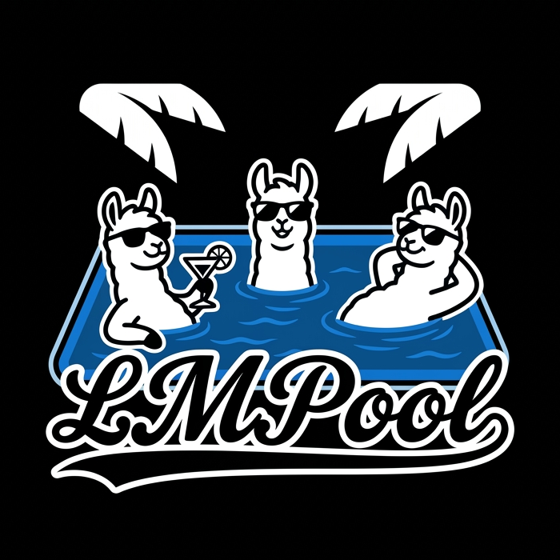
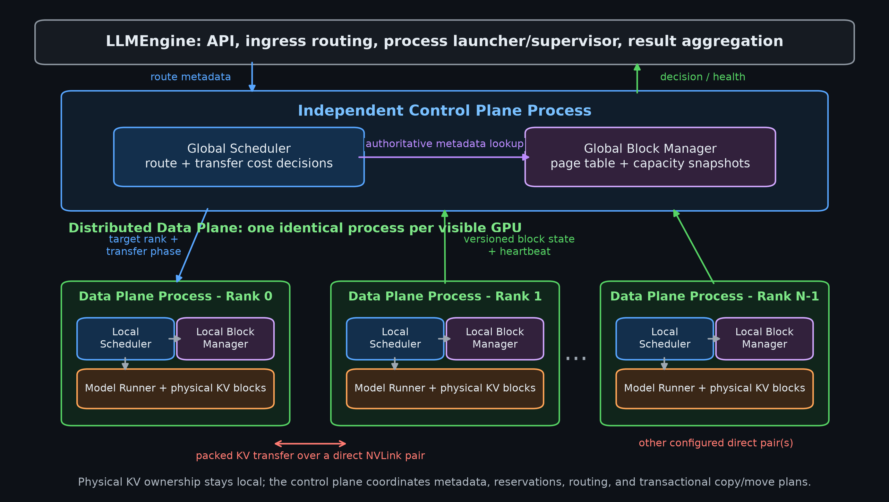
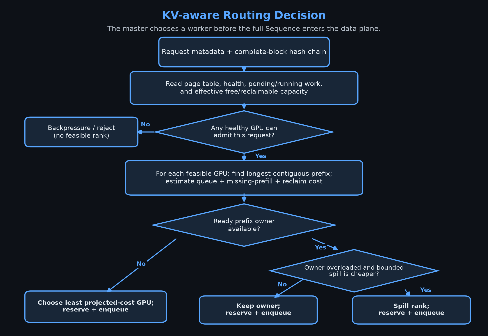
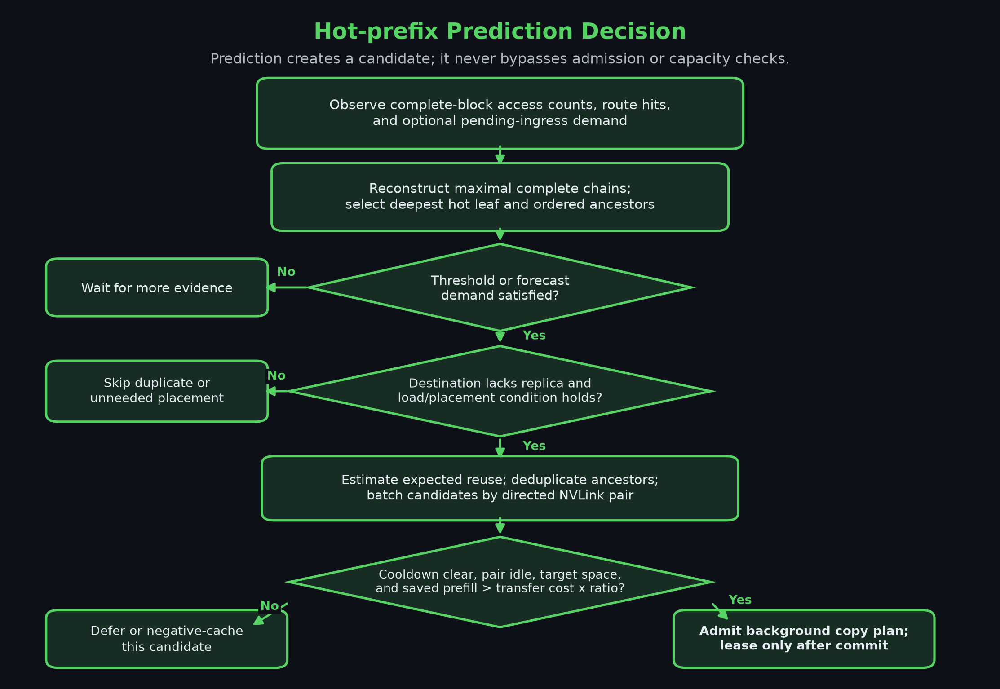
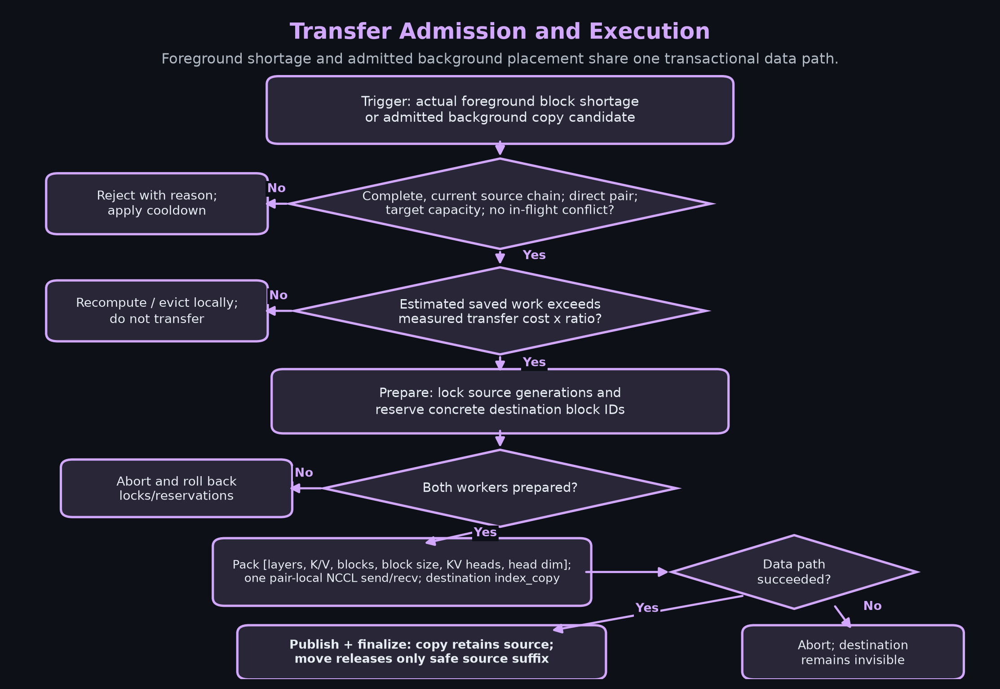
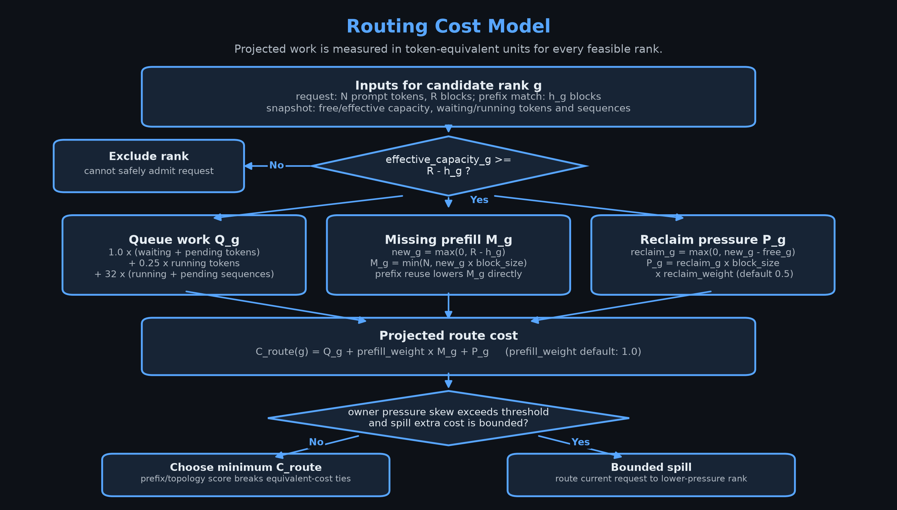
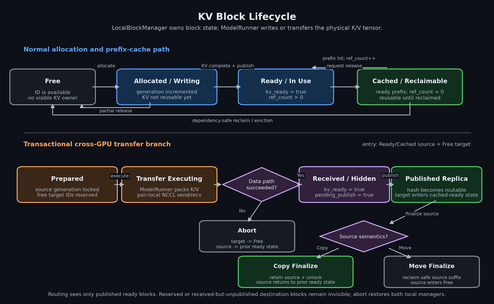
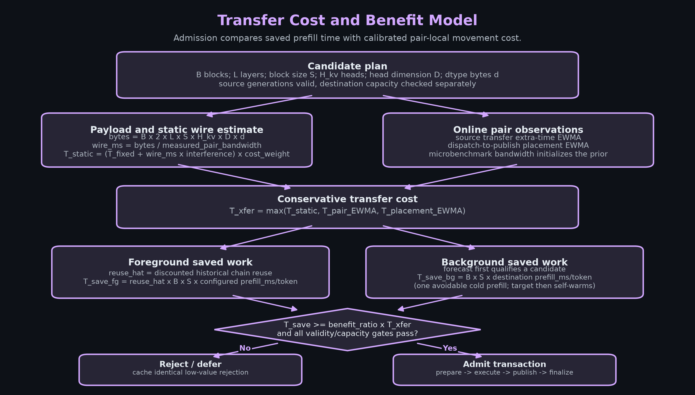

<p align="center">
  
</p>

<p align="center">
  <a href="./README.md"><b>English</b></a> |
  <a href="./README_zh.md"><b>简体中文</b></a>
</p>

# LMPool：面向多 GPU LLM 服务的 KV 感知路由与 NVLink 传输

LMPool 是一个基于 [Mini-vLLM](https://github.com/Wenyueh/MinivLLM) 的研究原型。它通过独立控制面，协调多个数据并行 LLM 实例中物理上仍驻留于各 GPU 的 PagedAttention KV cache。

系统遵循两条第一性原理：

1. **Routing Principle 解决 cache locality。** 当减少的 prefill 计算能够覆盖排队和容量压力时，将请求送到已经持有相关 KV prefix 的 GPU。
2. **Transfer Principle 解决 cache fluidity。** 当 KV 放置与请求负载不匹配时，仅在预期复用收益能够覆盖数据搬运成本的情况下，通过直连 NVLink 复制或迁移有价值的 block。

简言之：能通过路由避免传输就不传输；不可避免且有收益时才走快速传输。LMPool 提供的是逻辑统一的 KV 协调视图，而不是透明共享 HBM。每个 worker 仍然拥有本地 block 和 KV tensor 的物理所有权。

## 系统架构



对于 `N` 张 GPU，运行时包含一个用户/launcher 进程、一个独立控制面进程，以及 `N` 个完全对称的数据面进程。

| 组件 | 职责 |
| --- | --- |
| `LLMEngine` | 用户 API、master 侧 ingress、进程启动与监督、请求转发、结果聚合 |
| `control_plane_process` | 持有 `GlobalScheduler` 和 `GlobalBlockManager`，负责路由、全局元数据、transfer 计划、placement lease 和 heartbeat |
| `ControlPlaneClient` | LLMEngine 与 worker 用来和控制进程通信的队列协议端点 |
| `data_plane_process` | 每张 GPU 一个，持有本地 `Scheduler`、`BlockManager` 和 `ModelRunner` |
| `KV Transfer` | 将完整 KV block 打包，并在直连 NVLink pair 上执行配对的 NCCL send/receive |

### 请求流程

1. LLMEngine 创建 `Sequence`，将完整 block 的 prefix hash 和负载元信息发送给控制面。
2. `GlobalScheduler` 先选择目标 rank，完整 sequence 随后才进入目标 worker 队列。
3. 目标数据面进程在本地执行 prefill 和 decode。
4. worker 在状态变化后上报带版本号的 block 快照；控制面以 rank 为粒度原子替换全局元数据。
5. 真实的本地 block shortage 可以触发带成本门控的 foreground transfer；可预测的未来复用可以触发 background copy 和 placement lease。
6. 完成的 sequence 和逐 rank 指标回到 LLMEngine。

### 决策流程

**KV-aware routing**



**热点 prefix 预测**



**Transfer 准入与执行**



热点 prefix 预测综合三类信号：完整 prefix 链的累计 block 访问次数、route hit 次数，以及 ingress 已经看到但尚未提交的请求需求。控制面从最深热点叶子向前恢复全部常驻祖先。达到热点阈值只会产生候选，并不等于执行 transfer；目标尚无副本、源目标负载差、cooldown、pair 空闲、目标容量以及 saved-prefill/transfer-cost 收益门槛仍需全部通过。

数据 payload 只包含 K/V 数值。对于 `L` 层和 `B` 个 block，源端通过 indexed selection 聚合出一个连续的 `[L, 2, B, block_size, num_kv_heads, head_dim]` tensor，在 pair 专属 NCCL group 上执行一次发送；目标端接收后写入 prepare 阶段预留的物理 block。hash、generation、copy/move mode 和目标 block ID 通过控制面协议独立传递，不混入 NCCL tensor。

## 核心机制

### KV 感知路由

`GlobalScheduler.route_sequence_meta()` 只匹配从第 0 块开始连续的完整 prefix block 链。候选集合只包含初始 GPU 及其 NVLink 直连伙伴；不相关 GPU 会被直接排除。

拓扑亲和权重为：同 GPU 为 `2`，NVLink 直连伙伴为 `1`，其它 GPU 为 `0`。最终选择同时考虑未命中的 prefill 工作、waiting/running 负载、带 decode 权重的剩余工作、有效空闲容量和回收成本。当 prefix owner 明显过载且额外重算成本有界时，可以绕过 owner。路由预留用于防止并发请求同时消费同一份陈旧容量估计。

#### Routing 成本模型



对每个容量可行的 rank，路由器以 token-equivalent 单位估计排队工作、缺失 prefill 和回收压力。Prefix locality 通过直接减少 `missing prefill` 进入成本，而不是作为独立的命中率目标。系统通常选择预计成本最低的 rank；只有 prefix owner 的负载显著更高、且溢出到低压力 rank 的额外重算成本有界时才执行 spill。这里控制的是请求/负载倾斜和 GPU 利用失衡，并没有改变系统的数据并行执行策略。

### 全局与本地 Block 状态

控制进程持有权威全局页表：

```text
prefix hash -> [(gpu, physical block, generation, readiness), ...]
```

它还维护逐 GPU 的空闲/可回收容量、父子依赖、访问时间与频率、in-flight block、worker epoch 和快照版本。worker 不共享这个 Python 对象。每个本地 `BlockManager` 仍然对物理分配、引用计数、block readiness 和 KV tensor 负责，并向控制进程上报版本化快照。

完整缓存 block 使用满足前缀依赖约束的 LFU 优先、LRU 次序策略回收。活跃 block 不能作为 move eviction 的 victim；只有复制收益足够时才可以复制。

#### KV Block 生命周期



本地 block ID 从 `Free` 进入 `Allocated / Writing`；只有 ModelRunner 完成 K/V tensor 写入、BlockManager 将其发布为 `Ready` 后，它才可以被复用。最后一个请求引用释放后，完整 block 会作为可回收的 prefix-cache 条目保留；prefix hit 会使其重新进入活跃使用，而满足依赖约束的回收会使其返回 `Free`。

跨 GPU transfer 使用事务式生命周期。`prepare` 锁定源 block generation 并预留空闲目标 ID；ModelRunner 搬运打包后的 tensor；目标 block 在 `publish` 前保持不可见。copy finalize 保留源副本，move finalize 只回收安全且无引用的源端后缀，abort 则释放目标预留并恢复源状态。因此，路由不会观察到已预留或已接收但尚未发布的 block。

### NVLink KV Transfer

Foreground transfer 只申请实际 shortage，而不是整条 sequence 的 block 数量。Background placement 先用 `background_copy_max_blocks`（默认 8）限制每条候选链，再对同一有向 pair 的候选去重合并，总量受 `background_copy_batch_max_blocks`（默认 128）限制。因此 4 blocks 只是 microbenchmark 的校准档位，并不是固定线上 batch。两条路径都必须通过源块有效性、目标容量、最小批量，以及预计节省 prefill 时间与传输成本比值等门控条件。

#### Transfer 成本与收益模型



静态成本由 payload geometry、物理 pair 的实测有效带宽、固定协调延迟和干扰系数组成。运行时的 source-transfer 及 dispatch-to-publish 观测会更新 pair-local EWMA，准入取静态估计和在线观测中的最大值。Foreground 收益使用折扣后的 prefix 链复用次数；background 收益最多只计算一次可避免的冷 prefill，因为目标 GPU 第一次 miss 后会自行预热。只有节省的 prefill 时间超过配置的安全比例，并且源块有效、目标容量等门控全部通过时，plan 才会获准执行。

每个计划执行幂等事务：

```text
prepare -> execute -> publish -> finalize
                    \-> 失败时 abort
```

`prepare` 预留具体目标 block；`execute` 发送一个包含全部层 K/V 的连续 payload；`publish` 使目标 block 可见；`finalize` 只在 move 语义下释放源 block，copy 语义保留两份副本。hash 和物理 block generation 校验会拒绝陈旧计划。

### 一致性与活性

- 控制面在单一事件循环中串行化权威状态修改。
- 每个 client 的接收锁避免多个调用者误消费彼此的队列响应。
- worker epoch 和单调递增的快照版本拒绝陈旧状态。
- transfer plan ID 和阶段幂等；预留及 in-flight 标记阻止并发复用或回收。
- 双向 heartbeat 检测 worker/控制进程故障；LLMEngine 可以重启控制进程并请求 worker 全量快照。

这些机制提供故障检测和元数据恢复，但不是副本化高可用。launcher 故障仍会终止服务，worker 故障也可能丢失其物理 cache。

## 仓库结构

```text
src/lmpool/engine/
  llm_engine.py             launcher、ingress、监督
  control_plane.py          协议、client、控制进程事件循环
  global_scheduler.py       路由与 transfer plan 决策
  global_block_manager.py   全局页表与 block 快照
  data_plane.py             每 GPU worker 与 transfer 阶段执行
  scheduler.py              本地 prefill/decode 调度
  block_manager.py          本地分配与 prefix cache
  model_runner.py           模型/KV 执行与指标
  kv_transfer.py            打包后的 NCCL transfer 原语
  sequence.py               请求与 block table 状态

benchmarks/                 可用于论文的 microbenchmark 和 E2E workload
tests/                      模块、协议、benchmark 与集成测试
docs/paper/                 论文源码与参考文献
```

## 安装与基本运行

需要 Python 3.11 和支持 CUDA 的 PyTorch。

```bash
uv sync --group dev
```

根据可见 GPU 修改 `main.py` 中的 `world_size`、模型路径和逻辑 NVLink pair，然后运行：

```bash
CUDA_VISIBLE_DEVICES=0,1 UV_CACHE_DIR=/tmp/uvcache uv run python main.py
```

`nvlink_topo.pairs` 中的 GPU ID 是经过 `CUDA_VISIBLE_DEVICES` 重映射后的逻辑 ID。如果未显式配置拓扑，LMPool 会尝试解析 `nvidia-smi topo -m`，并且只保留 `NV#` 直连。每次实验前都应重新确认物理拓扑，不能根据 socket 或 NUMA 关系推断 NVLink pair。

## 实验评估

仓库保留三个完整 benchmark 入口：

| 入口 | 验证目标 |
| --- | --- |
| `benchmarks/benchmark_kv_transfer.py` | NCCL/NVLink payload 的 latency、bandwidth 和数据一致性 |
| `benchmarks/benchmark_kv_routing.py` | routing-only 的 locality 与 prefill reuse 收益 |
| `benchmarks/benchmark_e2e.py` | load-skew、memory-skew、session-handoff 下的五配置系统对比 |

双模型论文实验矩阵、固定变量、离线模型路径、验收标准和完整命令见 [benchmarks/PAPER_RUNBOOK.md](./benchmarks/PAPER_RUNBOOK.md)。指标和 workload 定义见 [benchmarks/README.md](./benchmarks/README.md)。

### 数据集前缀共享率

Benchmark 会在启动系统前对输入 trace 做 prefix sharing profiling。`trace req share` 表示能够复用至少一个先前已出现完整 KV block 的请求比例；`trace tok share` 表示所有 prompt token 中，被最长连续、block-aligned 已见前缀覆盖的比例。两者假设按 trace 顺序回放、无限缓存和完美放置，因此描述的是数据集，而不是运行时策略。论文 trace 的请求级/token 级共享率分别为：locality `91.67% / 86.20%`、load skew `97.40% / 90.57%`、memory skew `63.28% / 67.81%`、session handoff `75.00% / 70.49%`。运行时的 `DP req hit` 与 `DP tok reuse` 用于衡量系统实际实现了多少理论复用潜力。新生成的 JSON 会把完整计数写入 `metadata.dataset_profile`；归档论文批次也补充了派生文件 [`dataset_profiles.json`](./benchmarks/results/paper/20260719T072508Z/dataset_profiles.json)。

### 当前论文实验批次

实验数据：[`benchmarks/results/paper/20260719T072508Z`](./benchmarks/results/paper/20260719T072508Z)

该批次使用 5 次重复实验、6 张组成 3 对 NV4 直连的 RTX 3090、BF16 Qwen3-0.6B/Qwen3-1.7B、256-token KV block，并为每个 worker 配置相同 block budget。

- **Transfer microbenchmark：** 4-block batch 达到 19.0-23.2 GiB/s，8-block batch 达到 26.1-30.1 GiB/s；所有 payload 数据校验均通过。
- **Routing workload：** 两个模型的 prompt token reuse 从约 44% 提高到 72%，uncached prefill token 减少约 50%；吞吐提升 2.2-2.7%，mean TTFT 降低 10.6-20.2%。
- **Session handoff：** 相比 round-robin multi-GPU，完整 LMPool 在 Qwen3-0.6B/Qwen3-1.7B 上分别将吞吐提升 4.2%/7.1%，mean TTFT 降低 33.2%/42.6%，mean E2E latency 降低 9.9%/13.7%。
- **边界结果：** 稳定 load skew 没有触发 transfer，性能接近 multi-GPU baseline；当前 memory-skew trace 只触发少量 foreground plan，未提升吞吐。这是负结果/适用边界，不能作为 transfer 普遍有效的证据。

论文会同时报告以上四项观察。Session handoff 是当前主要端到端 transfer 结果，memory/load skew 不会被选择性省略。

## 测试

测试目录与 engine 和 benchmark 模块一一对应，覆盖 block 分配/回收、链式 hash、路由命中/未命中/容量不足、负载绕过、NVLink pair 过滤、页表 epoch/快照、容量预留、事务化 transfer 阶段、队列并发、进程生命周期、模型/KV dtype、benchmark schema/绘图和端到端完成。

CPU 与模拟测试：

```bash
CUDA_VISIBLE_DEVICES="" UV_CACHE_DIR=/tmp/uvcache uv run pytest -q
```

在一个物理 NVLink pair 上运行双 rank NCCL 数据一致性/死锁测试：

```bash
RUN_NCCL_INTEGRATION=1 CUDA_VISIBLE_DEVICES=0,1 UV_CACHE_DIR=/tmp/uvcache \
  uv run pytest -q tests/test_kv_transfer.py -s
```

测试与模块映射、硬件 gate 见 [tests/README.md](./tests/README.md)。

## 适用范围与限制

- 当前只对同节点 NVLink 直连 pair 做 transfer 决策，不会对 PCIe/NUMA fallback 打分。
- 全局页表协调的是元数据，不提供透明远端 block 寻址。
- 论文 workload 是确定性 synthetic trace，不是生产数据集。
- 当前证据支持 routing 和 session handoff，但不支持“transfer 对所有 memory/request skew 都有收益”的结论。
- 原型具有 heartbeat 和控制进程重启，但没有副本化 controller 或 launcher HA。
- 跨节点 RDMA、CPU/SSD cache tier、持久化 KV cache 和异构模型实例不在当前范围内。

## 论文

[论文目录说明](./docs/paper/README.md)包含源码、已核验的参考文献、可复现架构图和构建命令。[example_paper.tex](./docs/paper/example_paper.tex) 中的动机、系统机制、dataset/workload profiling、测试设计、实验结果、限制与 related work 已与当前代码和论文实验批次同步。
