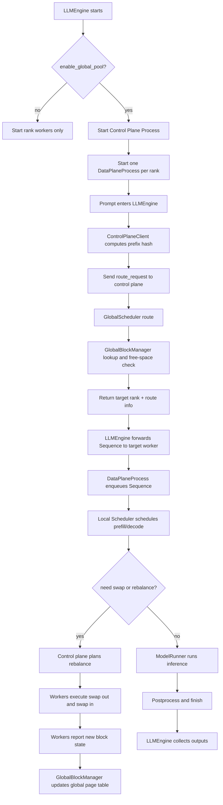
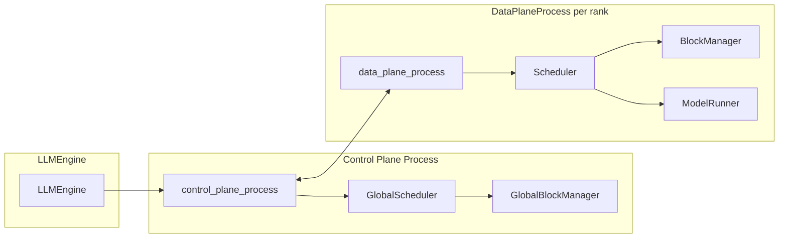
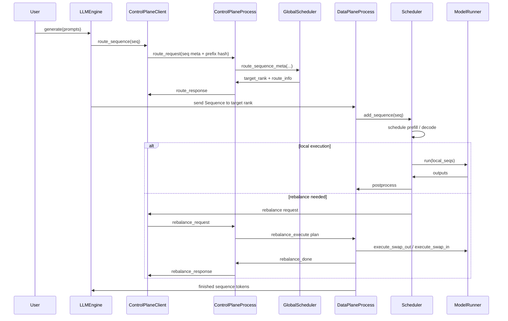

# LMPool System Notes

This document summarizes the current implementation in a form suitable for a paper draft:

- runtime flow
- component relationships
- control / data-plane interaction sequence
- implementation details

The codebase currently uses three layers:

- `LLMEngine`: launcher / supervisor
- `control_plane.py`: independent global control process
- `data_plane.py`: per-rank worker process

---

## 1. Runtime Flow

---

## 2. Component Diagram

---

## 3. Sequence Diagram

---

## 4. System Implementation

### 4.1 Process Layout

The current implementation separates orchestration and execution.

- `LLMEngine` is the launcher and top-level supervisor. It starts the control-plane process and one data-plane process per rank.
- `control_plane_process` is a dedicated global coordinator. It owns routing decisions, global block-table updates, rebalance planning, and heartbeat tracking.
- `data_plane_process` is the per-rank execution loop. It owns local scheduling, KV-cache allocation, model execution, and swap execution.

This layout is intentional: the control plane can be described as an independent process in a systems paper, rather than as logic embedded inside rank 0.

### 4.2 Request Routing

For each prompt, the launcher creates a `Sequence`, computes its prefix hash through `ControlPlaneClient`, and sends a `route_request` to the control plane.

`GlobalScheduler.route_sequence_meta()` then decides the target GPU using the current global page table and local free-space snapshot from `GlobalBlockManager`.

The current routing logic is:

1. compute the hash of complete blocks only
2. lookup the prefix in the global page table
3. prefer the GPU with the best prefix-hit score
4. otherwise fall back to the GPU with the most free blocks
5. reserve blocks optimistically after routing

### 4.3 Local Scheduling

Each `DataPlaneProcess` keeps its own `Scheduler`, `BlockManager`, and `ModelRunner`.

- prefill: schedule waiting sequences, allocate blocks, and run model forward
- decode: append tokens, capture completion, and keep running sequences in order
- memory pressure: if local space is insufficient, request rebalance from the control plane

### 4.4 Global Page Table

`GlobalBlockManager` stores:

- `global_page_table`: hash to physical block locations
- `free_blocks_per_gpu`: per-GPU free capacity
- `block_access_time`: per-block timestamps for LRU selection
- `block_hash`: per-GPU block hash snapshot

The authoritative state lives in the control plane process. Workers report local snapshots through block-state messages, and the control plane updates the global view.

### 4.5 Swap / Rebalance

When a GPU cannot make progress because it lacks free blocks, the control plane builds a rebalance plan and dispatches it to the affected workers.

The current path is:

1. `GlobalScheduler.plan_rebalance()`
2. control plane broadcasts the plan to source and destination ranks
3. workers execute `ModelRunner.execute_swap_out()` / `execute_swap_in()`
4. workers update local `BlockManager` state
5. workers report the new block snapshot back to the control plane

### 4.6 KV Transfer

`kv_transfer.py` implements the physical migration primitive using NCCL `send` / `recv`.

The transfer is block-granular and layer-wise:

- source sends block ids
- destination allocates target block ids
- K and V tensors are transferred for each layer
- both sides synchronize before returning

### 4.7 Logging and Observability

The code currently emits structured `INFO`-level logs for:

- prefill and decode activity per rank
- routing decisions and route reasons
- swap / rebalance execution
- worker heartbeats and control-plane heartbeats
- finish and idle transitions

This is sufficient for development and for reproducing routing / swap traces in experiments.
