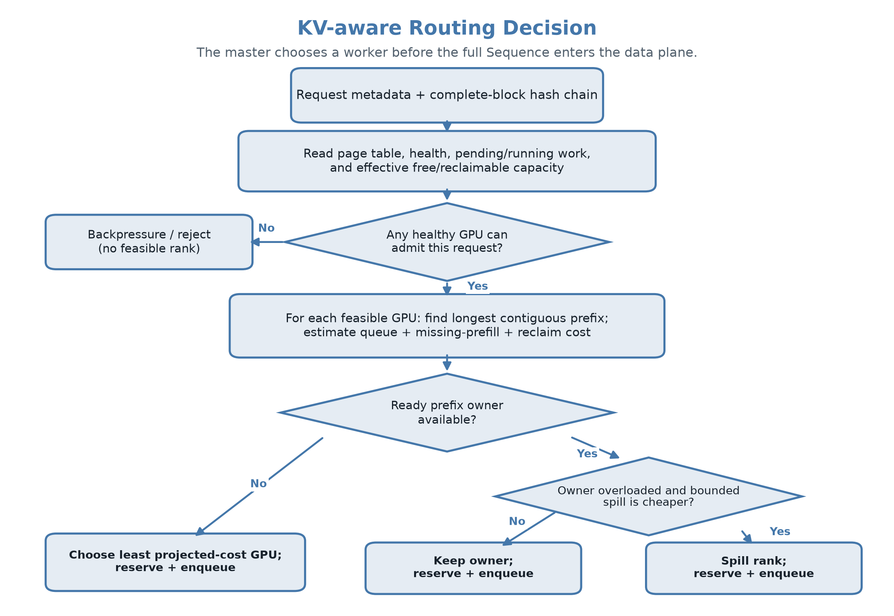
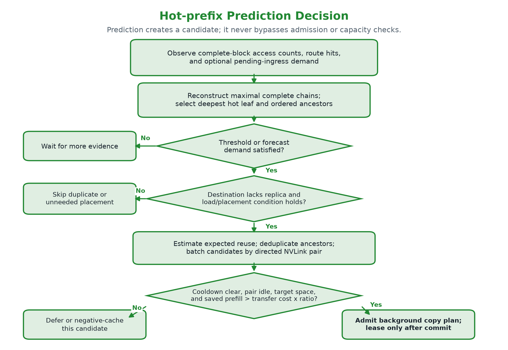
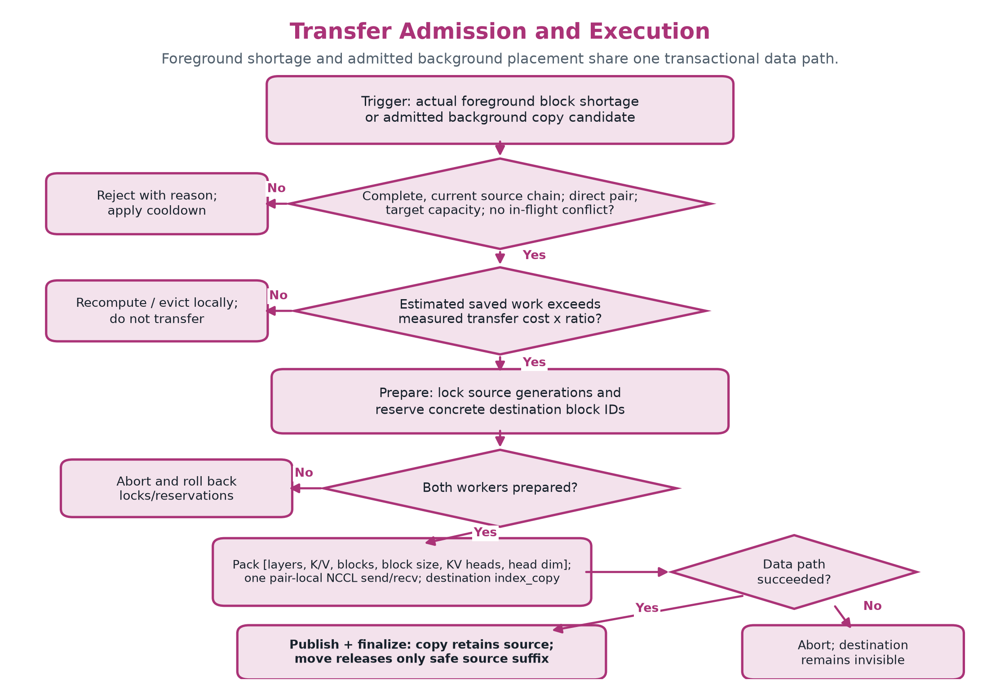
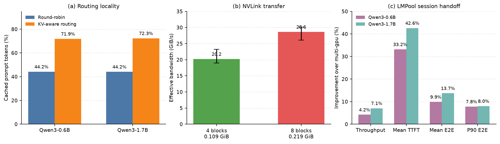
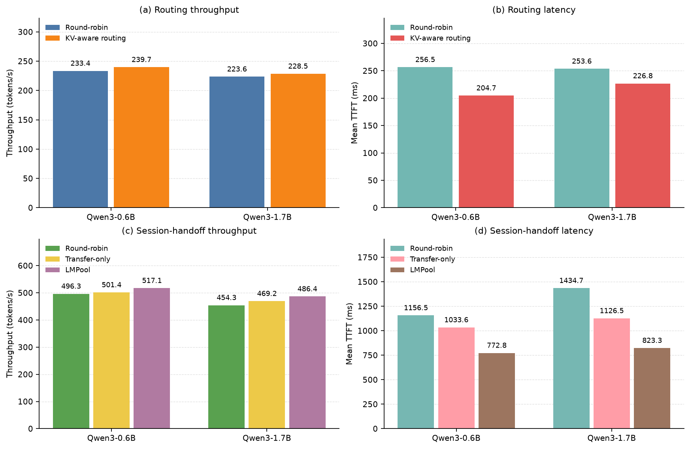
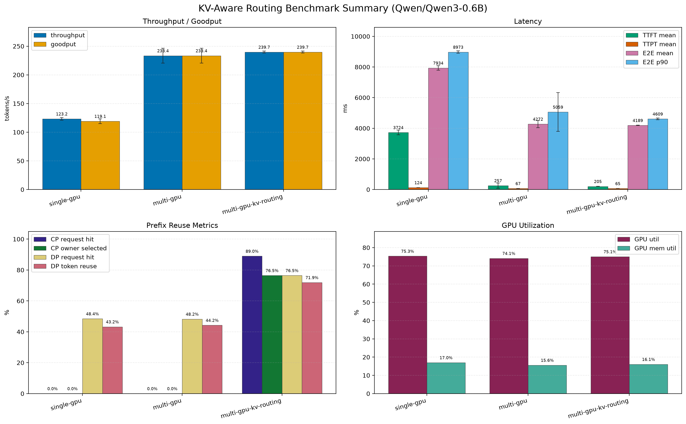
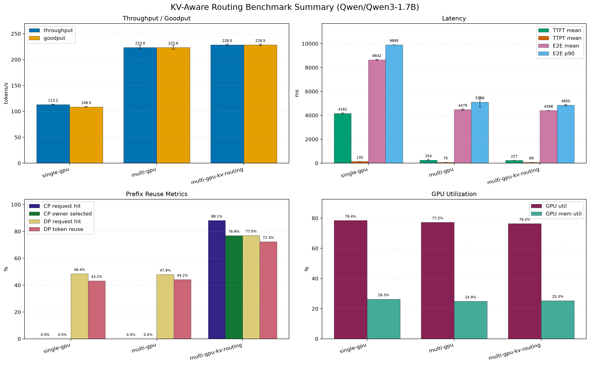
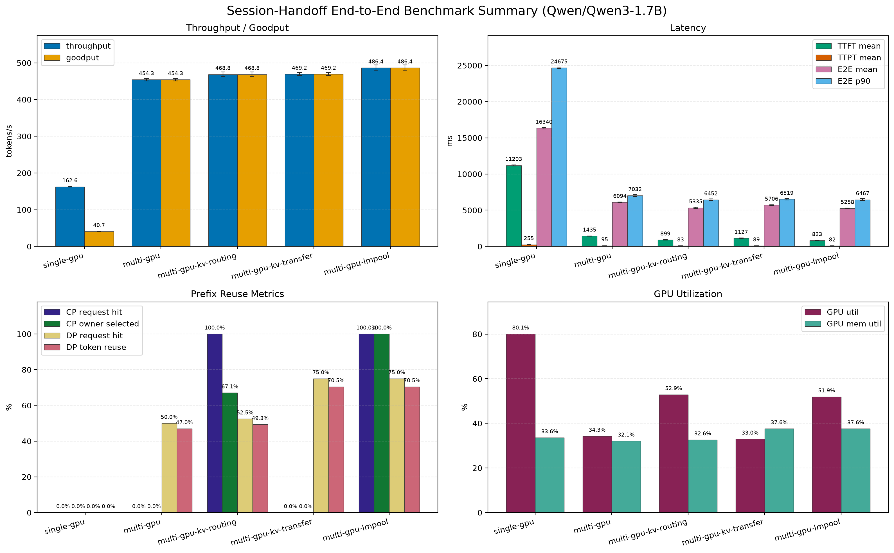

# LMPool 阶段性优化报告（2026-07-20）

> 本报告从完整的[决策记录](../flow/decisions.md)中提取已经保留、且由当前论文实验支持的最终方案。中间未产生稳定收益的参数尝试不作为汇报内容。实验数据来自 [`20260719T072508Z`](../../benchmarks/results/paper/20260719T072508Z)，所有端到端结果均为 5 次重复实验的均值。

## 1. 目标与原则

LMPool 面向多实例 LLM 服务中的两个互补问题：

1. **Routing Principle 解决 cache locality**：优先将请求发送到已经持有最长连续 KV prefix 的实例，减少重复 prefill 和后续 transfer。
2. **Transfer Principle 解决 cache fluidity**：当 KV 放置与后续请求位置不匹配时，仅在收益覆盖成本后，通过直连 NVLink 将 KV block 搬到目标实例。

最终策略可以概括为：**能通过路由本地复用就不传输；必须跨实例复用时，再使用批量 NVLink transfer 降低成本。**

## 2. 最终优化点

| 优化方向 | 最终实施 | 作用 |
|---|---|---|
| 负载感知 KV 路由 | 按最长连续 prefix、增量块需求、有效容量、排队与 decode 负载共同决策；只考虑本地 GPU 和 NVLink 直连伙伴 | 在保持并行度的同时提高本地 KV 复用，避免热点 owner 过载 |
| 批量 NVLink transfer | 将多层、多 block KV 合并为连续 payload；使用 NVLink pair 专属 P2P process group，预热 communicator，并移除 pair 操作中的全局 barrier | 避免六卡全局同步；按实际 shortage 或同 pair 候选合并结果确定 batch，以多 block payload 摊销固定开销 |
| 收益驱动的放置 | 使用实测 pair 带宽、固定延迟、在线 prefill EWMA 和预期复用次数估计 transfer 收益；session handoff 中合并、去重并批量下发放置计划 | 只执行预计可回收成本的 transfer，避免“为了 transfer 而 transfer” |
| 原子迁移与并发保护 | 使用 block generation/source lock 和 `prepare -> execute -> publish -> finalize/abort` 协议；目标块 publish 前不可见，失败可回滚；控制面请求按 ID 配对并支持版本化全量恢复 | 防止页表、引用计数和物理 KV 在并发 transfer 下失配，不给 decode 快路径增加全局锁 |
| 公平且可复现的评测 | 不同方案使用相同物理 KV block budget；双模型 BF16、固定 seed、5 次重复并报告标准差/95% CI；拆分 routing、transfer microbenchmark 和 E2E claim | 保证提升来自机制本身，而不是缓存容量、dtype 或单次波动 |

### 2.1 路由、热点预测与 Transfer 决策流程

**KV-aware routing**

图 1：master 在请求进入 worker 前过滤不可行 GPU，并在 prefix owner、负载感知 spill 与最低预计成本 rank 之间选择；没有可行 rank 时明确 backpressure。

**热点 prefix 预测**

图 2：完整 prefix 链访问次数、route hit 和可选 ingress future demand 只生成 background copy 候选。副本需求、负载/放置条件、cooldown、pair 空闲、目标容量与收益门槛任一不满足时，候选会等待、跳过或进入 negative cache。

**Transfer 准入与执行**

图 3：真实 foreground shortage 与已准入 background candidate 共用实测带宽成本门槛和事务化数据路径。prepare 或数据路径失败都会回滚；只有 publish 后目标副本才对 routing 可见。

实际数据路径将一个 plan 中所有层、K/V 和 block 聚合为连续的 `[layers, 2, blocks, block_size, kv_heads, head_dim]` tensor。源端使用 `index_select` 聚合，直连 pair 通过一次 NCCL send/recv 传输，目标端使用 `index_copy` 写入预留 block；hash、generation、mode 和目标 block ID 仍由控制面协议传递。

## 3. 实验设置

| 项目 | 配置 |
|---|---|
| GPU | 6 x RTX 3090 24 GiB；物理 NVLink pairs：`0-1`、`3-4`、`5-6` |
| 模型 | Qwen3-0.6B、Qwen3-1.7B，BF16 |
| Routing workload | 192 请求、16 个长共享前缀组、64 输出 token、KV budget 64 blocks/GPU |
| Session-handoff workload | 32 个前缀组；32 个 warmup 请求建立 owner，96 个 reuse 请求触发跨实例复用；KV budget 128 blocks/GPU |
| Transfer microbenchmark | 每个模型、每个 NVLink pair 测 1/2/4/8 blocks；100 次测量、20 次 warmup；逐块校验 KV 一致性 |

图 4：左图为 routing workload 的初始 prompt token 复用率；中图为 2 个模型、3 对 NVLink 上的平均带宽及 min-max；右图为 LMPool 相对 `multi-gpu` 在 session handoff 中的改进，时延项均按“下降比例”表示。

## 4. 关键结果

### 4.1 KV-aware routing

| 模型 | 方案 | Throughput (tok/s) | Mean TTFT (ms) | Cached prompt tokens | Uncached prefill tokens |
|---|---|---:|---:|---:|---:|
| Qwen3-0.6B | multi-gpu | 233.41 | 256.5 | 44.23% | 204,037 |
| Qwen3-0.6B | KV routing | **239.74** | **204.7** | **71.90%** | **102,814** |
| Qwen3-1.7B | multi-gpu | 223.57 | 253.6 | 44.16% | 204,293 |
| Qwen3-1.7B | KV routing | **228.47** | **226.8** | **72.35%** | **101,176** |

Routing 将未复用 prefill token 减少约 **49.6%/50.5%**，TTFT 降低 **20.2%/10.6%**，同时吞吐提升 **2.7%/2.2%**。这说明当前路由没有用并行度换取命中率，而是将 locality 收益转化为实际计算节省。

### 4.2 NVLink transfer data path

| Batch | Payload | Mean latency range | P95 latency range | Effective bandwidth range |
|---|---:|---:|---:|---:|
| 4 blocks | 0.109 GiB | 4.71-5.76 ms | 4.86-6.53 ms | **19.0-23.2 GiB/s** |
| 8 blocks | 0.219 GiB | 7.26-8.39 ms | 7.32-9.95 ms | **26.1-30.1 GiB/s** |

六组“模型 x NVLink pair”测试全部通过搬运前后 KV 一致性校验。带宽随 batch 增大而提高，证明连续 payload 和 pair-local 通信能有效摊薄固定开销。4 blocks 是被测校准档，不是固定线上批量：foreground 按实际 shortage 取块；background 每条候选链默认最多 8 blocks，并可在同一有向 pair 内去重合并到默认 128 blocks。线上成本模型应采用最接近实际 plan 大小的实测档位或分段拟合，而不是链路标称值。

### 4.3 组合系统：session handoff

| 模型 | LMPool vs. multi-gpu | Throughput | Mean TTFT | Mean E2E | P90 E2E |
|---|---|---:|---:|---:|---:|
| Qwen3-0.6B | 改进 | **+4.2%** | **-33.2%** | **-9.9%** | **-7.8%** |
| Qwen3-1.7B | 改进 | **+7.1%** | **-42.6%** | **-13.7%** | **-8.0%** |

两个模型中，LMPool 都执行了 224 次 copy-style block transfer，将 cached prompt token 比例从约 **47.0%** 提升到 **70.5%**。结果表明 routing 与 transfer 的组合收益在模型放大后仍然成立，并且 1.7B 上的 TTFT 和吞吐改进更明显。

## 5. 原始 Benchmark 聚合图

下面四张图由论文实验目录中的 benchmark 脚本直接生成，展示五次重复实验聚合后的绝对吞吐、goodput、时延、prefix reuse 和 GPU 利用率。它们与图 4 的结论性摘要互补，不经过相对增益换算。

图 5：论文主结论对应的绝对 throughput 和 mean TTFT。该图保留原始单位，直接对比 round-robin、transfer-only 和 LMPool，避免仅依赖相对增益。

### 5.1 Routing workload

**Qwen3-0.6B**

**Qwen3-1.7B**

### 5.2 Session-handoff workload

**Qwen3-0.6B**

**Qwen3-1.7B**

## 6. 验证与结论

- CPU 测试结果为 **181 passed, 1 skipped**；硬件 microbenchmark 对所有 NVLink pair 完成数据一致性校验。
- 当前证据支持三项论文结论：KV-aware routing 提升 locality；批量 NVLink transfer 提供可用的数据通路；二者在 session handoff 场景中共同改善 TTFT、E2E latency 和 throughput。
- 结论应限定在**长共享前缀和跨实例 handoff 可复用**的 workload。普通 load-skew/memory-skew 若没有足够未来复用，不应强制 transfer，也不作为当前主要性能结论。

因此，本阶段已经形成一条闭环：**路由先消除可避免的跨 GPU 数据移动，成本模型再批准不可避免且可摊销的 transfer，原子协议保证迁移后的页表与 KV 数据一致。**
