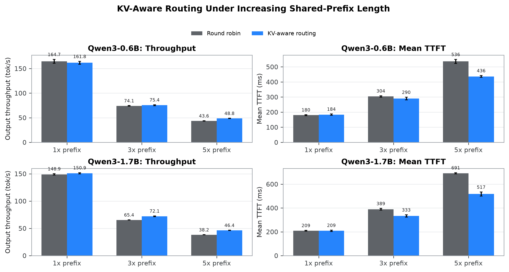
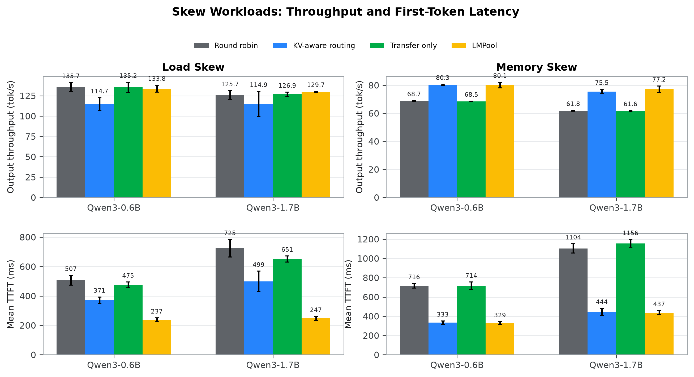
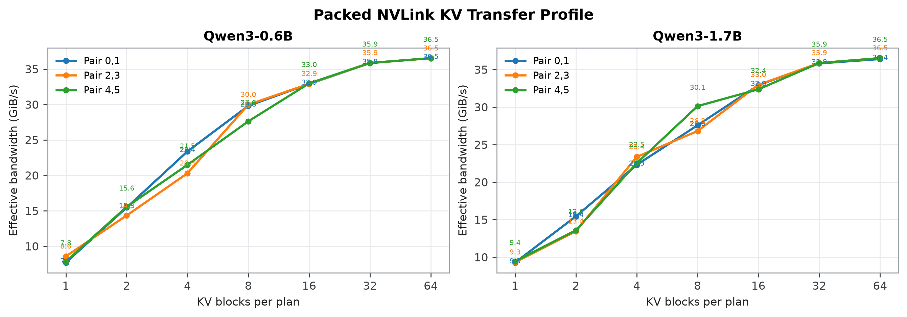

# LMPool Progress Report

Updated 2026-07-28. This report summarizes the retained design and the current
paper suite at [`20260727T231622Z`](../../benchmarks/results/paper/20260727T231622Z).
Every end-to-end value is the mean of five fixed-seed trials on six RTX 3090
GPUs. Earlier session-handoff results are not used because that workload has
been removed from the current evaluation matrix.

## System Position

LMPool combines two separate mechanisms. KV-aware routing addresses cache
locality by selecting a GPU with a ready matching prefix while considering
queued work and capacity. NVLink transfer addresses cache fluidity by copying
or moving a complete KV block chain when placement no longer matches useful
demand. The scheduler uses pair-specific measured P95 transfer profiles and
online transaction residuals. It accepts a plan only when saved prefill work
passes the transfer-cost and feasibility checks.

The current implementation uses versioned source chains, target reservations,
prepare--publish visibility, idempotent plan phases, and rollback. This keeps
partial destination state invisible to routing and allows a failed transfer to
preserve the source chain.

## Workloads

| Workload | Purpose | Shared Prefix Exposure | Key Construction |
|---|---|---:|---|
| Routing | Test locality-aware routing | 91.67\% of requests; 86.20--91.38\% of prompt tokens | 16 groups; 1x/3x/5x shared prefixes; 64 output tokens |
| Load skew | Test background copy and placement leases | 98.44\% of requests; 97.15\% of prompt tokens | 3 warm-up owners and 192 requests over 3 hot groups; 8 output tokens |
| Memory skew | Test foreground move and source release | 91.67\% of requests; 72.29\% of prompt tokens | 6 groups, 30 late pressure requests, 128-block common budget; 16 output tokens |

The workloads control prompt content and request order only. They do not force
a target rank, so copied replicas must still be selected by the normal routing
and feasibility logic.

## Results

At the 5x routing point, Qwen3-0.6B reduces uncached prefill from 884,997 to
354,821 tokens. Throughput rises from 43.6 to 48.8 tokens/s, mean TTFT falls
from 536 to 436 ms, and P90 E2E falls from 3,977 to 3,140 ms. Qwen3-1.7B
reduces uncached prefill from 885,816 to 345,605 tokens; throughput rises from
38.2 to 46.4 tokens/s, TTFT falls from 691 to 517 ms, and P90 E2E falls from
4,903 to 3,649 ms. This is the main end-to-end performance result.

Load skew confirms that background placement executes: three placements copy
87 blocks and placement leases route 95 later requests. LMPool substantially
reduces TTFT, but the full policy increases decode TPOT in this configuration.
Therefore mean E2E and throughput do not improve uniformly. Memory skew
confirms safe foreground release for Qwen3-0.6B: three foreground plans release
35 source blocks. It remains close to routing-only on serving metrics, and the
1.7B run does not meet the full offload verification predicate. These results
are retained as mechanism and boundary evidence, not as a universal transfer
speedup claim.

The microbenchmark validates byte-correct packed KV transfer over all three
NVLink pairs and both model geometries. P95 latency is measured for 1, 2, 4,
8, 16, 32, and 64 blocks and is used to initialize the payload-dependent part
of the admission model. It is not used as evidence of an end-to-end serving
gain by itself.

## Conclusion

The paper can make a strong, measured claim for routing under long shared
prefixes. It can also claim that transfer transactions, background placement,
placement leases, and safe source release are implemented and exercised. It
should not claim that transfer improves throughput or mean E2E latency in every
skewed workload. The current bottleneck is the interaction between copied-KV
placement and decode scheduling, which requires further policy evaluation on
production traces and larger serving deployments.
