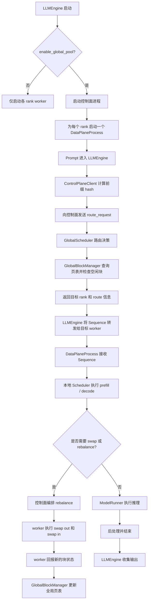
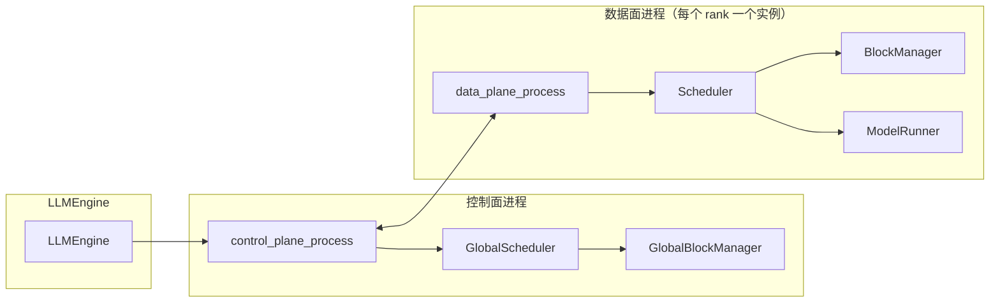
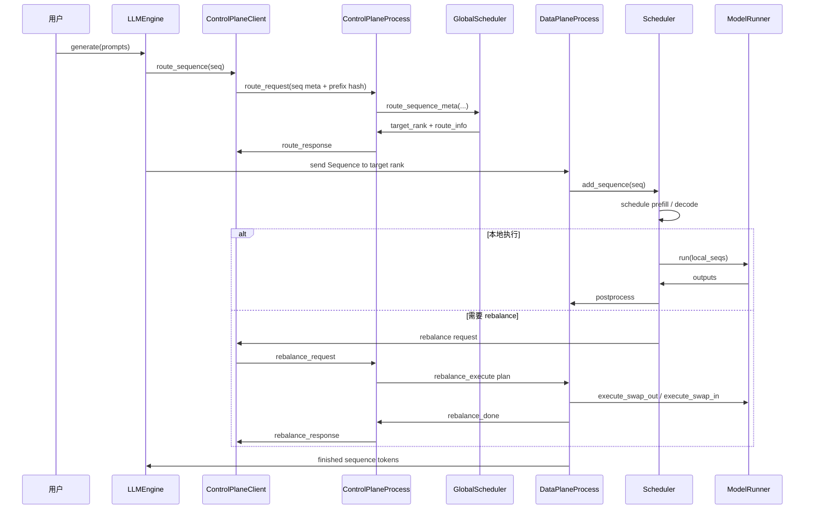

# LMPool 实现

本文档将当前实现整理为以下部分：

- 运行流程
- 组件关系
- 控制面 / 数据面交互时序
- 系统实现说明

当前代码分为三层：

- `LLMEngine`：launcher / supervisor
- `control_plane.py`：独立控制进程
- `data_plane.py`：按 rank 划分的数据面 worker

---

## 1. 运行流程

---

## 2. 组件图

---

## 3. 时序图

---

## 4. 系统实现说明

### 4.1 进程布局

当前实现将编排与执行分离。

- `LLMEngine` 是 launcher 和顶层 supervisor。它启动控制面进程，并为每个 rank 启动一个数据面进程。
- `control_plane_process` 是独立的全局协调器。它负责路由决策、全局块表更新、重平衡编排和心跳跟踪。
- `data_plane_process` 是每个 rank 的执行循环。它负责本地调度、KV cache 分配、模型执行和 swap 执行。

这种布局的目标是让控制面可以作为论文中独立的系统组件来描述，而不是嵌在 rank 0 中。

### 4.2 请求路由

对于每个 prompt，launcher 会构造 `Sequence`，通过 `ControlPlaneClient` 计算前缀 hash，并向控制面发送 `route_request`。

`GlobalScheduler.route_sequence_meta()` 会结合 `GlobalBlockManager` 中的全局页表和空闲块快照决定目标 GPU。

当前路由逻辑如下：

1. 只对完整块进行 hash
2. 在全局页表中查找前缀命中
3. 优先选择前缀命中分数最高的 GPU
4. 如果没有命中，则回退到负载较低、且空闲块与依赖安全可回收 cache
   合计能够接纳请求的 GPU
5. 按 sequence 乐观 reserve，直到目标 worker 完成首次 prefill

### 4.3 本地调度

每个 `DataPlaneProcess` 都维护自己的 `Scheduler`、`BlockManager` 和 `ModelRunner`。

- prefill：调度等待序列、分配块、执行模型前向
- decode：追加 token，并保持运行中的序列继续执行
- 显存压力：如果本地空间不足，则向控制面请求 rebalance

### 4.4 全局页表

`GlobalBlockManager` 维护：

- `global_page_table`：hash 到物理块位置
- `free_blocks_per_gpu`：每卡空闲容量
- 依赖安全的可回收容量和待提交路由 reserve
- `block_access_time`：用于 LRU 选择的时间戳
- `block_hash`：每卡 block hash 快照

权威状态保存在控制面进程中。worker 通过 block-state 消息回传本地快照，控制面据此更新全局视图。

### 4.5 Swap / Rebalance

当某个 GPU 因缺少空闲块而无法继续时，控制面会构建 rebalance 计划并下发给相关 worker。

当前路径如下：

1. `GlobalScheduler.plan_rebalance()`
2. 控制面向源 rank 和目标 rank 广播计划
3. worker 执行 `ModelRunner.execute_swap_out()` / `execute_swap_in()`
4. worker 更新本地 `BlockManager` 状态
5. worker 将新的块快照回传控制面

### 4.6 KV 传输

`kv_transfer.py` 使用 NCCL `send` / `recv` 实现物理迁移。

迁移粒度是 block 级、layer 级：

- 源端发送 block id
- 目标端分配目标 block id
- 每层传输 K/V 张量
- 双方同步后返回

### 4.7 日志与可观测性

当前代码会输出结构化的 `INFO` 级日志，包括：

- 每个 rank 的 prefill 和 decode 活动
- 路由决策及其原因
- swap / rebalance 执行
- worker 心跳和控制面心跳
- finish 和 idle 状态切换

这些日志足以支持开发调试和实验中的路由 / swap 追踪。
